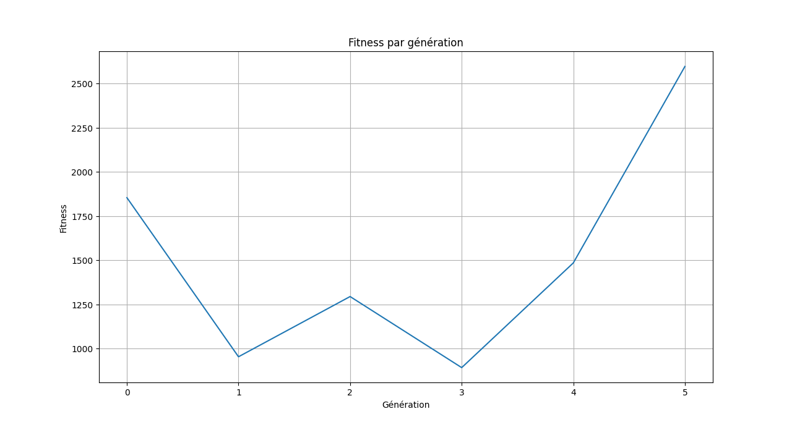

# Partie 1 : Algorithmes génétiques

## Consignes

Implémentation d'un algorithme génétique pour optimiser les paramètres d'un agent jouant au Snake. Le projet se concentre sur trois méthodes principales : **evaluate**, **select**, et **reproduce**.

---

## 🔑 Points clés pour l'implémentation

### 1. Évaluation (`evaluate`)

**Objectif** : Chaque agent (serpent) joue au jeu et calcule sa fitness.

**Implémentation** :
- Chaque serpent de la population joue une partie complète jusqu'à sa mort
- La fitness est calculée avec une fonction améliorée qui récompense mieux les bons comportements :
  - **Score de base** : `score * 200` (chaque nourriture mangée = 200 points)
  - **Bonus quadratique** : `(score ** 2) * 50` (bonus exponentiel pour encourager les scores élevés)
  - **Survie** : `steps * 0.5` (récompense pour survivre, plus importante qu'avant)
  - **Pénalité de faim** : `-steps_without_food * 0.1` (pénalité réduite pour donner plus de chances)
  - **Bonus d'efficacité** : `(score / steps) * 100` (récompense les serpents qui mangent rapidement)
- Cette méthode met à jour la valeur de fitness de chaque individu
- La population est triée par fitness décroissante (meilleurs en premier)

**Implémentation** : Voir `genetic_algorithm.py`, méthode `evaluate()`

---

### 2. Sélection (`select`)

**Objectif** : Choisir les meilleurs serpents pour produire la génération suivante.

**Méthodes implémentées** :
- **Élitisme** : Les 10% meilleurs individus (5 serpents) sont conservés directement
- **Tournoi** : Pour le reste de la population, sélection par tournoi
  - Choisir k individus aléatoires (k = 5 par défaut)
  - Prendre le meilleur parmi ces k participants
  - Répéter jusqu'à avoir assez de serpents

**Retour** : Un sous-ensemble des meilleurs individus (taille = taille de la population)

**Implémentation** : Voir `genetic_algorithm.py`, méthode `select()`

---

### 3. Reproduction (`reproduce`)

**Objectif** : Créer une nouvelle population à partir des serpents sélectionnés.

**Implémentation** :
- **Crossover** : Combine les chromosomes (réseaux neuronaux) des parents
  - Taux de crossover : 70%
  - Méthode : Pour chaque poids du réseau neuronal, choisir aléatoirement entre le poids du parent 1 ou du parent 2
  - Si pas de crossover (30%), copier directement un parent
- **Mutation** : Introduit de la variation
  - Taux de mutation : 10%
  - Modifie aléatoirement certains poids du réseau neuronal
  - Permet d'explorer de nouvelles solutions
- **Mise à jour** : 
  - Met à jour la population avec la nouvelle génération
  - Incrémente le compteur de générations

**Implémentation** : Voir `genetic_algorithm.py`, méthode `reproduce()`

---

## 📁 Structure du projet

```
snake_game_with_neural_network_and_genetic_algorithm/
│
├── main.py                    # Point d'entrée principal
├── genetic_algorithm.py       # Implémentation de l'algorithme génétique
│                              #   - evaluate() : Évaluation de la population
│                              #   - select() : Sélection des meilleurs
│                              #   - reproduce() : Reproduction avec crossover et mutation
├── neural_network.py          # Réseau de neurones (feedforward)
├── snake.py                   # Classe Snake avec logique du jeu et calcul de fitness
├── game.py                    # Gestion du jeu et affichage
├── config.py                  # Configuration (taille grille, couleurs, etc.)
├── utils.py                   # Utilitaires (graphiques)
├── requirements.txt           # Dépendances Python
└── README.md                  # Ce fichier
```

---

## 🧠 Améliorations du réseau de neurones et de la vision

### Réseau de neurones amélioré
- **Architecture** : 19 entrées → 24 neurones cachés → 4 sorties
- **Initialisation** : Xavier/He pour une meilleure convergence
- **Fonction d'activation** : ReLU pour la couche cachée, Sigmoid pour la sortie

### Vision améliorée (19 entrées)
Le serpent perçoit maintenant :
- **Distance à la nourriture** : 2 valeurs (dx, dy avec wrap-around)
- **Direction vers la nourriture** : 2 valeurs (dir_x, dir_y normalisées)
- **Détection d'obstacles** : 4 valeurs (distance au corps dans chaque direction)
- **Direction actuelle** : 4 valeurs (one-hot encoding)
- **Informations supplémentaires** : 7 valeurs (longueur, steps sans nourriture, distance euclidienne, positions tête/nourriture)

Cette vision enrichie permet au serpent de prendre de meilleures décisions.

---

## ⚙️ Paramètres de l'algorithme génétique

Les paramètres sont définis dans `genetic_algorithm.py` :

- **Taille de la population** : 100 serpents (augmenté de 50 pour meilleur apprentissage)
- **Taux de mutation** : 15% (augmenté pour plus d'exploration)
- **Taux de crossover** : 80% (augmenté pour favoriser la combinaison des bonnes caractéristiques)
- **Élitisme** : 15% de la population (15 meilleurs serpents conservés)
- **Taille du tournoi** : 7 individus (augmenté pour meilleure sélection)
- **Nombre de générations** : 500 (augmenté de 100 pour permettre un meilleur apprentissage, configurable dans `main.py`)
- **Limite de steps par partie** : 5000 (augmenté de 3000)
- **Limite steps sans nourriture** : 300 (augmenté de 200)

---

## 📊 Remarques pratiques

### Taille de la population
- 100 serpents (augmenté de 50)
- Permet une meilleure diversité génétique et exploration de l'espace de solutions

### Nombre de générations
- 500 générations (augmenté de 100)
- Configurable dans `main.py` : `max_generations = 500`
- Permet un apprentissage plus approfondi et une meilleure convergence

### Taux de mutation et de crossover
- **Mutation** : 15% (augmenté de 10%) pour plus d'exploration tout en préservant les bonnes solutions
- **Crossover** : 80% (augmenté de 70%) pour favoriser la combinaison des caractéristiques

### Suivi de la progression
- Stockage de la meilleure fitness de chaque génération dans `self.history`
- Affichage amélioré dans la console : `Génération X - Meilleure fitness: Y, Score: Z, Fitness moyenne: A, Meilleur score global: B`
- Graphique de progression à la fin de l'exécution


---

## 🔄 Cycle d'évolution

Le cycle complet de l'algorithme génétique :

1. **Initialisation** → Population de 100 serpents avec réseaux neuronaux aléatoires (19 entrées, 24 neurones cachés, 4 sorties)
2. **Évaluation (evaluate)** → Chaque serpent joue jusqu'à 5000 steps et calcule sa fitness améliorée
3. **Sélection (select)** → Choisir les meilleurs serpents (élitisme 15% + tournoi de taille 7)
4. **Reproduction (reproduce)** → Créer nouvelle génération (crossover 80% + mutation 15%)
5. **Répétition** → Retour à l'étape 2 pour la génération suivante (jusqu'à 500 générations)

---

## 📈 Résultats attendus

Au fil des générations, vous devriez observer :

- **Génération 1-20** : Serpents qui meurent rapidement, mangent rarement
- **Génération 20-50** : Serpents qui commencent à se diriger vers la nourriture
- **Génération 50-100** : Serpents qui mangent régulièrement (score 1-3)
- **Génération 100-200** : Serpents qui mangent efficacement et survivent plus longtemps (score 3-5)
- **Génération 200-500** : Serpents qui optimisent leur stratégie et atteignent des scores élevés (score 5+)

Le graphique de fitness devrait montrer une courbe ascendante, indiquant que les serpents apprennent progressivement à mieux jouer.

---

## 🔧 Dépannage

### Les serpents n'apprennent pas
- Vérifiez que la fitness augmente dans la console (devrait augmenter progressivement)
- Avec 500 générations et 100 serpents, l'apprentissage prend du temps mais est plus efficace
- La fonction de fitness améliorée récompense mieux les bons comportements

### Performance lente
- L'évaluation de 100 serpents peut prendre du temps (c'est normal)
- Chaque génération peut prendre plusieurs minutes selon la performance
- Pour accélérer : réduisez la population à 50 dans `genetic_algorithm.py` (ligne 9)
- Réduisez `max_steps` dans `evaluate()` (ligne 31) pour limiter la durée des parties
- Réduisez `max_generations` dans `main.py` (ligne 18) si vous voulez tester rapidement

---

## 📝 Notes

- Le code est documenté avec des commentaires expliquant les concepts clés
- Les trois méthodes principales (`evaluate`, `select`, `reproduce`) sont implémentées selon les consignes
- Le projet suit les principes de l'algorithme génétique classique

